# StockFlow ERP

**An inventory and warehouse management system built like a real internal business application.**
Multi-warehouse stock, purchasing with approval, sales with all-or-nothing shipping, warehouse transfers, an
append-only stock ledger, analytics, and a BI view layer for Power BI.

Next.js 16 · React 19 · TypeScript (strict) · Tailwind CSS 4 · Supabase (PostgreSQL 17, Auth, Row Level Security) ·
Recharts · Vitest

---

## Contents

1. [Overview](#overview)
2. [The business problem](#the-business-problem)
3. [Features](#features)
4. [Architecture](#architecture)
5. [Tech stack](#tech-stack)
6. [Database](#database)
7. [Inventory engine](#inventory-engine)
8. [Main workflows](#main-workflows)
9. [Analytics, alerts and reports](#analytics-alerts-and-reports)
10. [Authentication and roles](#authentication-and-roles)
11. [Screenshots](#screenshots)
12. [Running locally](#running-locally)
13. [Environment variables](#environment-variables)
14. [Testing](#testing)
15. [Project structure](#project-structure)
16. [Design decisions](#design-decisions)
17. [Future improvements](#future-improvements)

---

## Overview

StockFlow ERP covers the daily work of a distributor with five warehouses:

- **Master data:** products, categories, warehouses, suppliers and customers. Records are deactivated, never deleted.
- **Inventory:** stock per product and warehouse, kept by an append-only ledger in which every change is one audited movement.
- **Purchasing:** purchase orders (draft → submit → admin approval) and goods receipts, full or partial.
- **Sales:** sales orders with line discounts, picking, and an all-or-nothing shipment.
- **Transfers:** request → admin approval → execution, moving stock between warehouses.
- **Monitoring:** a KPI dashboard with charts, a live alerts center, reports with CSV export, and a full audit trail.

All figures are in Israeli shekels (ILS) and all business dates use Israel time. The demo data (60 products,
5 warehouses, 10 suppliers, 30 customers, orders and transfers) is fictional.

## The business problem

Small and mid-sized distributors often run inventory in spreadsheets or loosely connected tools. Typical results:

- **Stock numbers that nobody trusts.** Quantities get overwritten, two people sell the same last units, and
  nobody can say why the count changed.
- **No audit trail.** Mistakes are "fixed" by editing history, so the books and the shelves drift apart.
- **Approvals on paper.** Purchase orders are placed without sign-off, and goods are received against orders
  that were never approved.
- **Late decisions.** Low stock and late deliveries are noticed only when a customer complains.

StockFlow addresses each of these at the **database level**, not only in the UI:

| Problem | How StockFlow solves it |
| ------- | ----------------------- |
| Untrusted quantities | Stock changes only through one PostgreSQL function that locks the row, refuses negative stock and writes a ledger entry, all in one transaction |
| Overselling under concurrency | Row locking: the second of two simultaneous shipments waits, re-reads the stock, and is refused. This is proven by tests on a real PostgreSQL server |
| Edited history | `stock_movements` and `audit_log` are append-only (enforced by a trigger); corrections are reversal movements |
| Missing approvals | Status machines enforced by triggers: a PO can't be received unless an admin approved it |
| Late reaction | Alerts computed live from SQL views; a KPI dashboard and reports that all use the same numbers |

## Features

**Master data**

- Products with SKU, barcode, category, unit, cost and sale price, minimum stock and reorder quantity. The SKU is locked once stock has moved.
- Warehouses, suppliers and customers, each with create, edit and deactivate. Deactivation keeps the history.
- Search, filters, sorting and pagination on every list. Detail pages show related figures and history.

**Inventory**

- Stock per product × warehouse with an *In Stock*, *Low Stock* or *Out of Stock* status.
- Inventory value is calculated in a single SQL view.
- Manual adjustments require a reason, and any manual movement can be reversed.
- A ledger of every movement shows the quantity before and after.

**Purchasing**

- Purchase order workflow: Draft → Submitted → Approved (admin) → Partially received → Received, or Cancelled.
- Goods receipts, including partial deliveries. Over-receipt is refused.
- A receipt can be reversed; once every receipt is reversed, the order can be cancelled.
- Supplier figures: purchase value, received value, open orders and last order.

**Sales**

- Sales order workflow: Draft → Confirmed → Processing → Shipped → Completed, or Cancelled.
- Line discounts. The database calculates every total.
- Shipping is all-or-nothing, and a refusal names every product that is short.
- A shipment can be reversed instead of cancelled; the order returns to Confirmed.
- Customer figures: total purchases, open orders, last order and credit limit usage.

**Transfers**

- Request → approve or reject (admin) → execute. Execution posts a TRANSFER_OUT and a TRANSFER_IN together.
- If the source is short on any line, nothing changes.

**Monitoring and analytics**

- Dashboard: 10 KPIs, inventory value by warehouse, low-stock bullets, purchases vs sales over time, movements
  by type and the top 10 products. It has a date-range filter, and every chart has a table view.
- Alerts center: low stock, out of stock, delayed POs, unprocessed sales orders, POs waiting for approval and
  pending transfers.
- Reports with CSV export: Inventory Valuation (as of any date), Stock Movement Report and Low Stock Report.
- Audit log (admins only): who did what and when, with filters, per-record history and changed fields shown as
  *old → new*.
- BI views (`v_*`) ready for Power BI.

**Quality**

- 320+ offline tests covering the database rules, every role's permissions, the workflows and the analytics
  numbers, plus 15 live tests on the hosted database.
- Live concurrency tests on a real PostgreSQL connection pool.
- Strict TypeScript with no `any`, and ESLint.

## Architecture

```
 ┌──────────────────────────────────────────────────────────────────────────┐
 │  Browser                                                                 │
 │  React 19 Client Components: forms, charts (Recharts), toasts            │
 └───────────────┬──────────────────────────────────────────────────────────┘
                 │ HTTPS (cookies carry the Supabase session)
 ┌───────────────▼──────────────────────────────────────────────────────────┐
 │  Next.js 16 App Router (Node.js)                                          │
 │   proxy.ts ........ refreshes the session, redirects anonymous users      │
 │   Server Components  read data (lib/data/*)                               │
 │   Server Actions     validate input, check the role, call RPCs            │
 │   Route handlers     CSV exports                                          │
 │   The user's JWT is forwarded: the DATABASE decides what is allowed       │
 └───────────────┬──────────────────────────────────────────────────────────┘
                 │ Supabase JS (PostgREST): table reads + RPC calls
 ┌───────────────▼──────────────────────────────────────────────────────────┐
 │  Supabase                                                                 │
 │  ┌──────────────┐  ┌──────────────────────────────────────────────────┐  │
 │  │  Auth (JWT)  │  │  PostgreSQL 17                                    │  │
 │  └──────────────┘  │   Row Level Security on every table               │  │
 │                    │   Workflow functions (SECURITY DEFINER, 1 txn):   │  │
 │                    │     receive_goods · ship_sales_order ·            │  │
 │                    │     execute_stock_transfer · reversals ...        │  │
 │                    │          │ all call ▼                              │  │
 │                    │   Inventory engine: create_stock_movement /       │  │
 │                    │     reverse_stock_movement                        │  │
 │                    │     lock row → check ≥ 0 → ledger → stock → audit │  │
 │                    │   Triggers: status machines, append-only, audit   │  │
 │                    │   Views: summaries, alerts, BI (v_*)              │  │
 │                    └──────────────────────────────────────────────────┘  │
 └───────────────┬──────────────────────────────────────────────────────────┘
                 │ PostgreSQL connection (read-only views)
          ┌──────▼──────┐
          │  Power BI   │
          └─────────────┘
```

**Why this shape:** the business rules live in the database, so they hold for every client: the web app, a
script, a future mobile app or a BI tool. The Next.js layer handles the user experience: validation messages,
permission-aware buttons and navigation. It is never the only guard.

## Tech stack

| Layer | Technology | Notes |
| ----- | ---------- | ----- |
| Frontend | Next.js 16 (App Router), React 19, TypeScript strict | Server Components, Server Actions, `next/form` |
| Styling | Tailwind CSS 4, lucide-react | Small shared components in `src/components/ui` |
| Charts | Recharts 3 | Palette validated for colour-vision deficiency; every chart has a table view |
| Database | PostgreSQL 17 (Supabase) | 14 migrations: tables, triggers, functions, views, RLS |
| Auth | Supabase Auth | Email and password; role stored in `profiles`, never trusted from the client |
| Testing | Vitest, PGlite (embedded Postgres), `pg` | Offline database tests and live concurrency tests |
| Tooling | ESLint 9, a custom type generator | `npm run db:types` generates types from the migrations, with no Docker needed |

## Database

### Schema summary

| Area | Tables |
| ---- | ------ |
| Identity | `roles`, `profiles` (1:1 with `auth.users`, created by trigger) |
| Master data | `categories`, `products`, `warehouses`, `suppliers`, `customers` |
| Stock | `inventory` (product × warehouse, `CHECK quantity >= 0`), `stock_movements` (append-only ledger) |
| Purchasing | `purchase_orders`, `purchase_order_items`, `goods_receipts`, `goods_receipt_items` |
| Sales | `sales_orders`, `sales_order_items` (gross, discount and net are generated columns) |
| Transfers | `stock_transfers`, `stock_transfer_items` |
| Audit | `audit_log` (append-only) |

The schema is fully normalised. Every table has UUID or identity keys, foreign keys, `created_at` / `updated_at`,
CHECK constraints for business rules, and indexes on foreign keys and common filters. Document numbers
(`PO-000001`, `GR-…`, `SO-…`, `TR-…`, `MV-…`) come from sequences. Header totals come from triggers over the
lines, so they can't be typed in wrong.

### Entity-relationship diagram

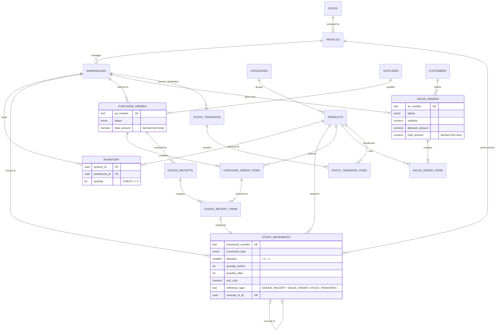

Sales and transfer movements reference their document through `reference_type` / `reference_id`, a polymorphic
reference, so the diagram doesn't draw them as foreign keys. The engine checks that the referenced document exists.

### Migrations

| Migration | Contents |
| --------- | -------- |
| `20260925000100_foundation` | enums, roles, profiles (auto-created from Auth), role helpers, audit log |
| `20260925000200_master_data` | categories, warehouses, products, suppliers, customers |
| `20260925000300_inventory` | inventory, stock movement ledger |
| `20260925000400_documents` | purchase orders, goods receipts, sales orders, transfers (+ lines, totals) |
| `20260925000500_audit_triggers` | audit triggers on master data |
| `20260925000600_rls_policies` | privileges and Row Level Security |
| `20260925000700_inventory_engine` | `create_stock_movement`, `reverse_stock_movement`, valuation views |
| `20260925000800_warehouse_editing_inventory_totals` | warehouse maintenance rules, `inventory_totals()` |
| `20260926000100_purchasing_role` · `…0200_purchasing_workflow` | purchasing role, PO workflow, `receive_goods` |
| `20260927000100_sales_role` · `…0200_sales_orders` · `…0300_stock_transfers` | sales role, SO workflow, `ship_sales_order`, transfers |
| `20260927000400_analytics` | BI views, alerts, dashboard and report functions |

## Inventory engine

Stock is never typed into a table. Every change (a receipt, a sale, a transfer, an adjustment or a correction)
goes through **`create_stock_movement`**, which does all of this as **one transaction**:

1. **Find the stock record and lock it** (`SELECT … FOR UPDATE`). It is created with quantity 0 on first use.
2. **Check the result.** If the new quantity would be below zero, the function stops (*"Insufficient stock: 5
   available, 6 requested"*) and nothing is saved.
3. **Write the ledger entry**, with the quantity before and after, unit cost, reference, reason, user and date.
4. **Update the quantity** on the inventory row.
5. **Write an audit entry.**

**Concurrency.** When two people ship the last 7 of 10 units at the same moment, the second request **waits** for
the first, then reads the new quantity (3) and is refused. `CHECK (quantity >= 0)` is the final safety net.

**Reversals.** History is never edited: `reverse_stock_movement` posts a new, opposite movement linked to the
original. A movement can be reversed once. A reversal can't itself be reversed. Reversing a receipt whose stock
has already been used is refused.

**One engine for every module.** Goods receipts, shipments and transfers all call these two functions. A guard
trigger ensures that movements belonging to a document can only be posted or reversed by that document's
workflow, so an order and its stock can never drift apart.

## Main workflows

### Purchasing: PO → goods receipt → stock movement → inventory

```
 Purchase order ──submit──▶ ──approve (admin)──▶ Goods receipt ──▶ PURCHASE_RECEIPT ──▶ Inventory ↑
 (what we ordered)                              (what arrived)    (one per line)
```

1. **Purchase order.** Purchasing enters a supplier, a destination warehouse, dates and lines. The database
   numbers the order and totals it. A new order is a **Draft**.
2. **Submit.** The lines and header are frozen. An **administrator approves** the order.
3. **Receive.** From the order, or from the *Awaiting delivery* list on the Goods Receipts page, a warehouse
   manager enters what actually arrived, which may be a partial delivery.
   `receive_goods` does the following in one transaction:
   - locks the order, so two receivers are handled one after the other;
   - refuses any over-receipt;
   - creates the receipt;
   - calls `create_stock_movement` for each line;
   - updates the received quantities, the status and the audit log.
4. **Inventory** rises immediately. Each ledger entry links back to its receipt.

```
Draft ─▶ Submitted ─▶ Approved ─▶ Partially received ─▶ Received
  └──────────┴───────────┴─▶ Cancelled   (only while nothing is received; never touches stock)
```

A received order can't be cancelled. Instead, `reverse_goods_receipt` undoes a receipt through
`reverse_stock_movement` and resets the order's quantities and status.

### Sales: sales order → shipment → stock movement

```
 Sales order ──confirm──▶ Processing ──ship──▶ SALE movements ──▶ Inventory ↓
```

1. **Sales order.** Sales enters the customer, warehouse and lines, with price and discount per line. The
   database calculates each line and the order totals. The order is **confirmed** once the customer commits.
2. **Processing.** The warehouse starts picking.
3. **Ship.** `ship_sales_order` locks the stock rows in a fixed order (so it can't deadlock) and checks
   **every** line first. If any line is short, the whole shipment is refused with one message naming every
   short product, and nothing ships partially. Otherwise it posts one `SALE` per line through the engine.
4. **Completed.** The delivery is done and the order is closed.

```
Draft ─▶ Confirmed ─▶ Processing ─▶ Shipped ─▶ Completed
  └──────────┴────────────┴─▶ Cancelled   (only while unshipped; never touches stock)
             ▲                     │
             └──── shipment reversed (reverse_sales_order_shipment)
```

### Transfers: request → approval → execution

1. **Request.** A warehouse manager chooses source, destination (they must differ), products and quantities.
2. **Approve or reject.** An administrator decides.
3. **Execute.** `execute_stock_transfer` locks both warehouses' rows and checks that the source has enough of
   every product. It then posts a `TRANSFER_OUT` at the source and a `TRANSFER_IN` at the destination per line.
   If anything is short, nothing changes at either warehouse.

An executed transfer is corrected by a transfer back, never by reversing one side.

All three status machines are enforced by triggers, so invalid transitions are refused even for direct SQL.

## Analytics, alerts and reports

The dashboard, reports, CSV exports and BI tools all read the **same SQL views and functions**, and tests check
that they agree with raw SQL. The definitions:

| Term | Definition |
| ---- | ---------- |
| Inventory value | quantity × current cost price, from the single `inventory_valuation` view |
| Low / out-of-stock items | product × warehouse lines (active product, active warehouse) at or below the minimum / at zero |
| Pending purchase orders | submitted, approved or partially received |
| Pending sales orders | confirmed or processing |
| Purchases | value of goods received (receipt qty × PO unit cost), by receipt date; reversed receipts excluded |
| Sales | net revenue after discounts of shipped / completed orders, by ship date; reversed shipments excluded |
| COGS / margin | shipped qty × the unit cost the SALE movement was posted at / net revenue − COGS |
| Business date | the date in Israel (Asia/Jerusalem); the database clock is UTC |

**Alerts** are computed on read by the `v_alerts` view; there is no alerts table that could go out of date:

| Alert | Rule | Severity |
| ----- | ---- | -------- |
| Out of stock | active product at an active warehouse with 0 on hand | critical |
| Low stock | on hand at or below the minimum | warning |
| Delayed purchase order | approved or partly received and past the expected delivery date | warning; critical after 7 days |
| Unprocessed sales order | confirmed or processing for over 2 days, or past the requested delivery date | warning; critical if late |
| PO waiting for approval | submitted, not yet approved | info |
| Pending transfer | requested or approved, not yet executed | info |

**Reports** (each with CSV export using the same filters as the screen):

| Report | Filters | Notes |
| ------ | ------- | ----- |
| Inventory Valuation | as-of date, warehouse, category | stock as recorded in the ledger at the end of that day, valued at current cost prices |
| Stock Movement Report | date range, warehouse, category, type | every ledger entry, with units and value in and out |
| Low Stock Report | warehouse, category, status | shortfall and a suggested order quantity |

CSV exports include a UTF-8 marker, so Excel shows Hebrew and ₪ correctly. Cells that start with `= + - @` are
neutralised, so a product name can never run as a spreadsheet formula.

**BI views for Power BI:** `v_inventory_valuation`, `v_stock_movements`, `v_movements_daily`,
`v_purchase_receipts`, `v_sales_lines`, `v_sales_by_product`, `v_purchases_monthly`, `v_sales_monthly`,
`v_low_stock` and `v_alerts`. To connect: *Get data → PostgreSQL database*, server
`aws-<n>-<region>.pooler.supabase.com:5432`, database `postgres`, then import the `v_*` views.

## Authentication and roles

Users sign in with Supabase Auth, and accounts are created by an administrator; there is no public sign-up. Each
account has a **profile** with one **role**. The role is read from the database on every request and never taken
from the client. Every table has Row Level Security. Deactivated users can only read their own profile, and
anonymous visitors get nothing.

| Capability | Admin | Warehouse Manager | Purchasing | Sales |
| ---------- | :---: | :---------------: | :--------: | :---: |
| Read operational data, dashboard, reports, alerts | ✅ | ✅ | ✅ | ✅ |
| Create / edit products and categories | ✅ | ✅ | – | – |
| Create / edit / deactivate warehouses | ✅ | ✅ | – | – |
| Post stock adjustments and reversals | ✅ | ✅ | – | – |
| Create / edit / deactivate suppliers | ✅ | – | ✅ | – |
| Create, edit, submit, cancel purchase orders | ✅ | – | ✅ | – |
| Approve purchase orders | ✅ | – | – | – |
| Receive goods, reverse goods receipts (see *Segregation of duties*) | ✅ | ✅ | – | – |
| Create / edit / deactivate customers | ✅ | – | – | ✅ |
| Create, edit, confirm, cancel sales orders | ✅ | – | – | ✅ |
| Process and ship orders, reverse shipments | ✅ | ✅ | – | – |
| Complete sales orders | ✅ | ✅ | – | ✅ |
| Request, execute, cancel transfers | ✅ | ✅ | – | – |
| Approve / reject transfers | ✅ | – | – | – |
| Manage users, read the audit log | ✅ | – | – | – |
| Write stock, ledger or documents directly; hard-delete anything | – | – | – | – |

The whole table is tested for every role (`tests/db/roles.test.ts`). The same test also checks that the UI's
permission helpers, which decide which buttons appear, match what the database allows.

**Segregation of duties.** The table deliberately splits each purchase across three roles.

- **Purchasing** creates and submits purchase orders.
- **An administrator** approves them.
- **A warehouse manager** confirms that the goods physically arrived.

Purchasing can't receive goods. Otherwise one person could order goods and confirm a delivery that never
happened, and stock and supplier spend would be inflated with nobody else noticing. Receiving is checked in two
places: `receive_goods` and `reverse_goods_receipt` refuse the purchasing role in the database, and the UI hides
the button. A purchasing user sees open orders in the *Awaiting delivery* list, with a note saying who receives
them. Sales follows the same split: sales confirms orders, and the warehouse ships them. Administrators can do
everything, which suits a small demo team. In a real company that full access would be limited to very few
people, and the audit log would show when one person both approved and received an order.

## Screenshots

**Dashboard (KPIs and charts)**
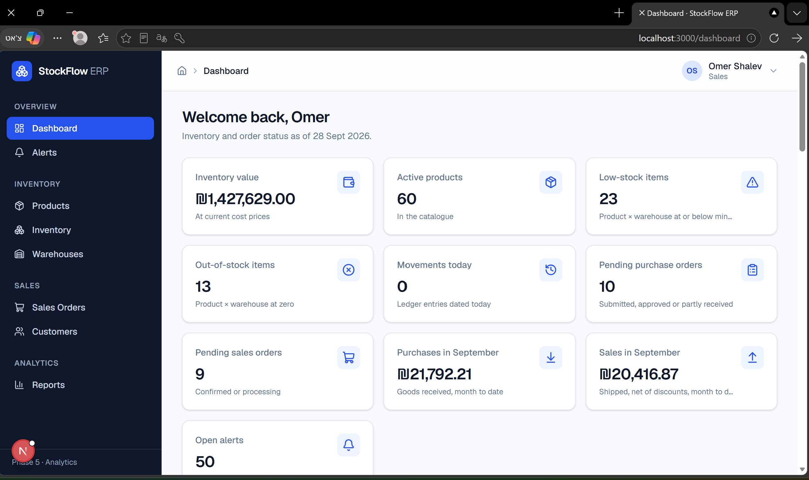

**Inventory with stock status badges**
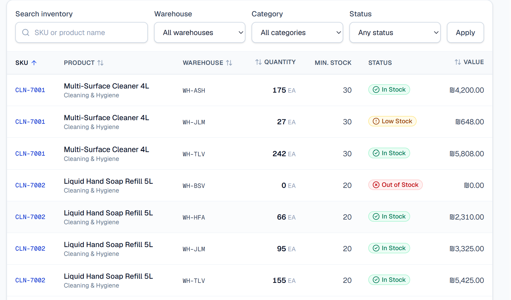

**Purchase order detail with receipts**
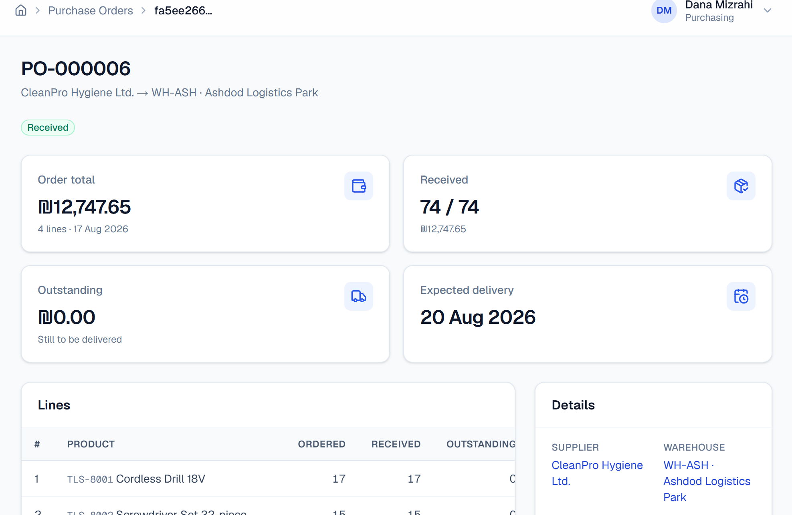

**Goods receipt form (partial delivery)**
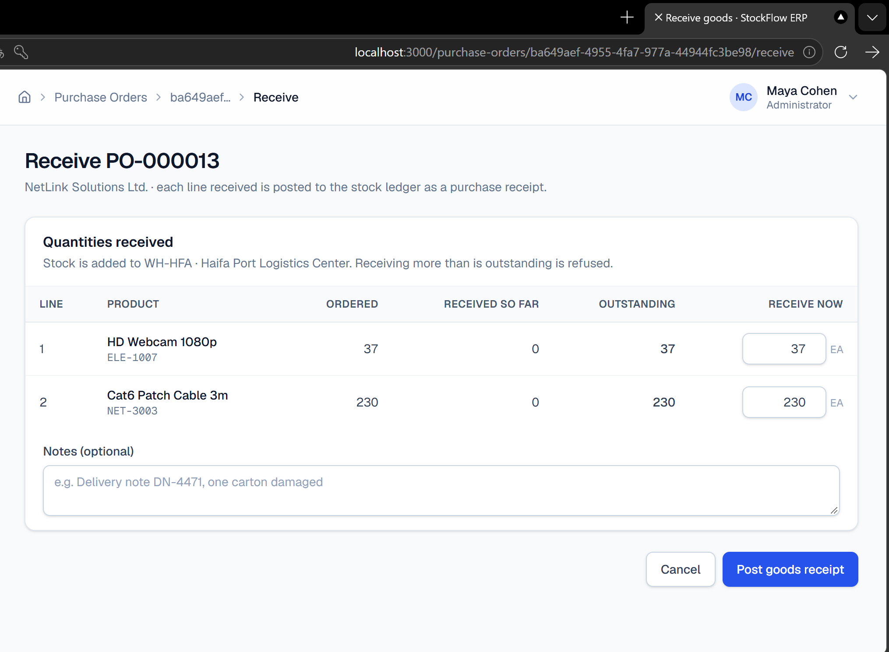

**Shipment refused for insufficient stock**
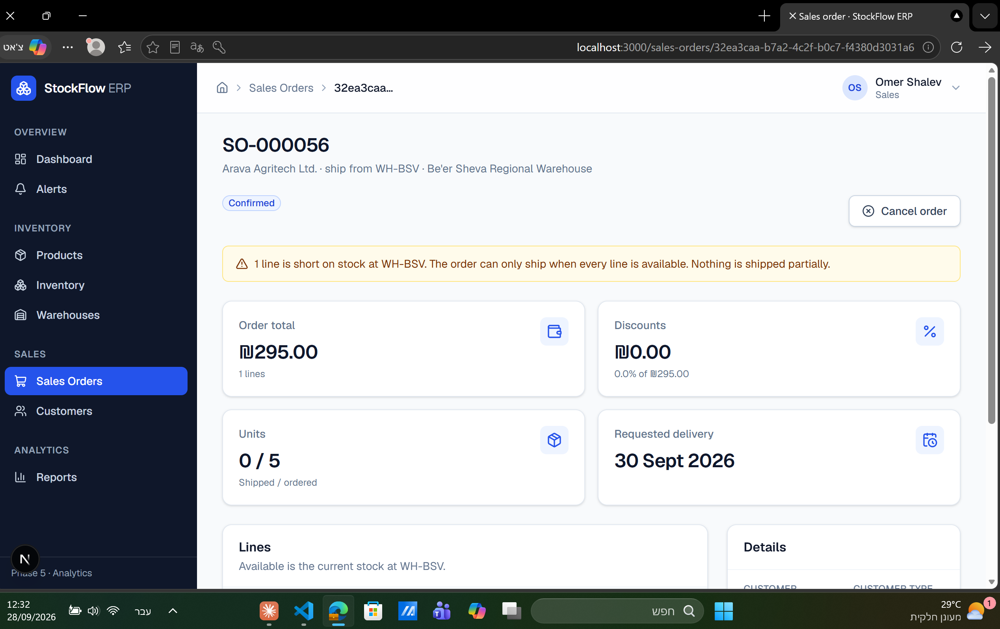

**Stock movement ledger with a reversal**
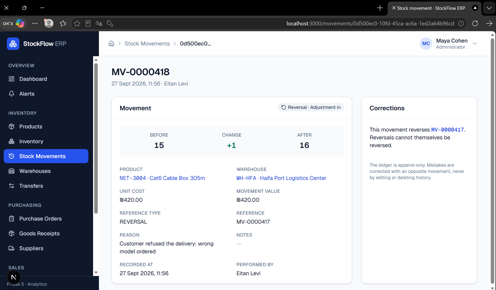

**Alerts center**
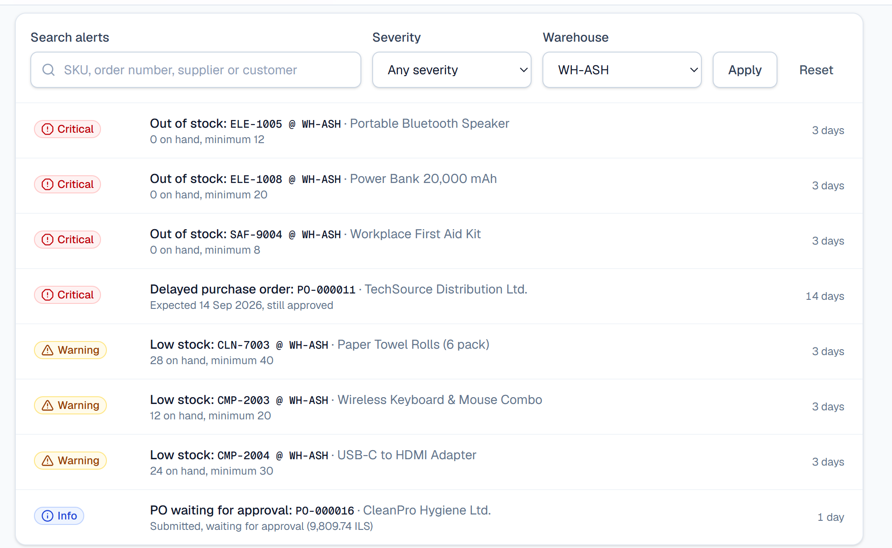

**Inventory Valuation report**
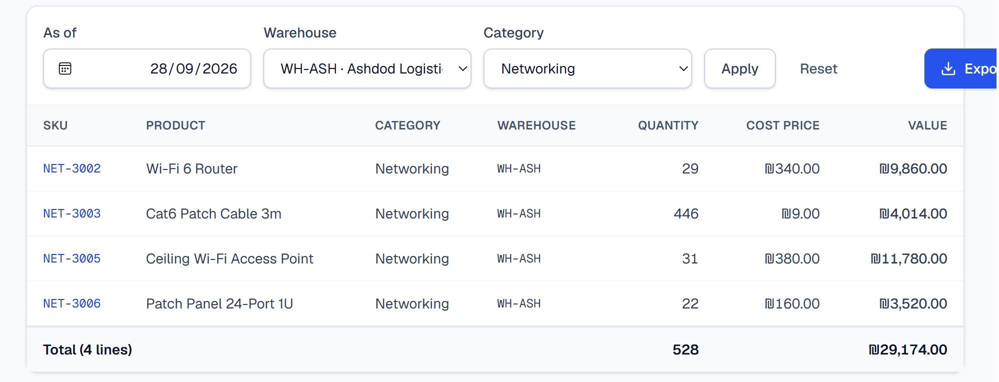

**Audit log with old and new values**
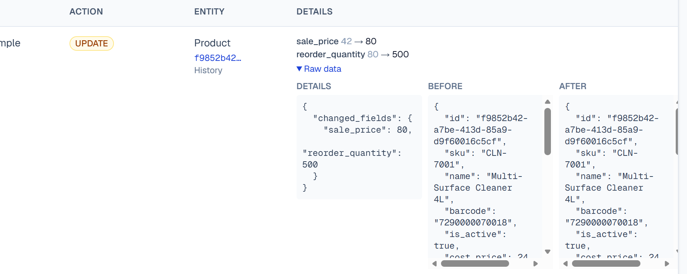

**Mobile view**
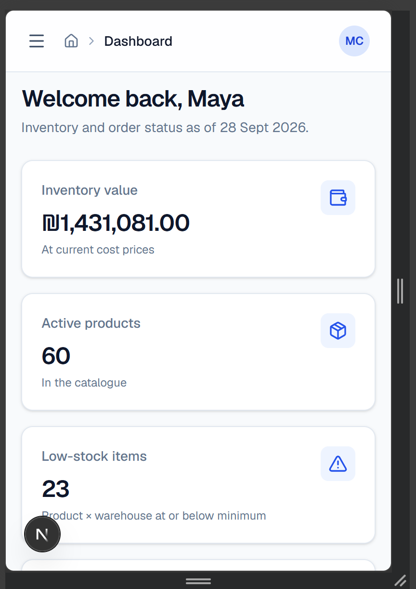

## Running locally

### Prerequisites

- Node.js 20.9 or newer (22 recommended)
- A free [Supabase](https://supabase.com) project, **or** Docker Desktop plus the Supabase CLI for a local stack

### 1. Install

```bash
npm ci                         # exact versions from package-lock.json
cp .env.example .env.local     # then fill in the values (see below)
```

On Windows PowerShell, use `npm.cmd` / `npx.cmd` and `Copy-Item .env.example .env.local`.

### 2. Create the database

**Hosted Supabase:**

```bash
npx supabase login
npx supabase link --project-ref <your-project-ref>
npx supabase db push --include-seed      # applies all migrations + supabase/seed.sql
```

Then, in the Supabase dashboard, go to **Authentication → Sign In / Providers** and turn off "Allow new users to
sign up".

**Or local Supabase (Docker):**

```bash
npx supabase start             # prints the API URL and keys for .env.local
npx supabase db reset          # applies all migrations + seed
```

### 3. Load demo data and start

```bash
npm run seed:demo              # demo users, opening stock, 20 POs, 30 sales orders, 4 transfers
npm run dev                    # http://localhost:3000
```

`seed:demo` runs `seed:users`, `seed:stock`, `seed:purchasing` and `seed:sales` in order. Every demo document is
created **through the real workflow functions**, signed in as the demo user whose role allows each step, so
all demo stock has a complete ledger and audit trail.

### Demo accounts

Password for all accounts: `StockFlow!2026` (override with `DEMO_USER_PASSWORD`).

| Email | Role |
| ----- | ---- |
| `admin@stockflow.example` | Administrator |
| `manager.tlv@stockflow.example` | Warehouse Manager (Tel Aviv, Ashdod) |
| `manager.hfa@stockflow.example` | Warehouse Manager (Haifa, Jerusalem, Be'er Sheva) |
| `purchasing@stockflow.example` | Purchasing |
| `sales@stockflow.example` | Sales |

## Environment variables

| Variable | Used by | Description |
| -------- | ------- | ----------- |
| `NEXT_PUBLIC_SUPABASE_URL` | app | Supabase API URL |
| `NEXT_PUBLIC_SUPABASE_PUBLISHABLE_KEY` | app, seed scripts | Publishable key (`sb_publishable_…`) or legacy anon key. `NEXT_PUBLIC_SUPABASE_ANON_KEY` is also accepted |
| `SUPABASE_SERVICE_ROLE_KEY` | `seed:users` only | **Secret.** Service-role key used to create the demo accounts. Never exposed to the browser |
| `DEMO_USER_PASSWORD` | seed scripts | Optional password for the demo accounts |
| `DATABASE_URL` | `test:live` only | **Secret.** Postgres connection string (Supabase *Connect → Session pooler*) |
| `DATABASE_CA_CERT` | `test:live` only | Optional path to the Supabase CA certificate, to verify TLS |

`.env.local` is git-ignored. Never commit it.

## Testing

```bash
npm run check          # typecheck + lint + all offline tests
npm test               # offline tests only
npm run test:live      # concurrency and live-data tests (needs DATABASE_URL)
npm run smoke          # render every page as every role (needs a running server, see below)
```

**Offline suite (320+ tests, no Docker).** Each test file gets a brand-new embedded PostgreSQL
([PGlite](https://pglite.dev)) with a small Supabase stub, all migrations and the seed applied from scratch. It
checks the following:

- **Schema:** RLS on every table, timestamps, constraints, an idempotent seed and valid EAN-13 barcodes.
- **Inventory engine:** receipts; negative stock refused with nothing left behind; reversals, once only; the audit entry.
- **Purchasing:** full and partial receipts; over-receipt refused; cancel before receipt; no cancel after
  receipt; receipt reversal; invalid transitions refused even by direct SQL.
- **Sales:** discounts and totals; shipment; insufficient stock refused, naming the product with nothing
  partially applied; cancel vs reverse; re-shipping.
- **Transfers:** a successful transfer updates both warehouses; insufficient stock changes neither; the same
  warehouse is refused; a single leg can never be reversed.
- **Analytics:** dashboard KPIs = raw SQL = reports = BI views; revenue, COGS and margin; alert rules; audit
  coverage of every workflow.
- **Role matrix:** every role × every table write and workflow function; database vs UI permission helpers.
- **Unit:** validators, CSV escaping and formula guard, date ranges, business-date handling.

**Render smoke check.** `npm run build`, then `npm run start -- -p 3100`, then `npm run smoke`. It signs in as each
demo role and renders every page, including detail pages in the states that show action buttons (about 250
renders). A Server Component that crashes still returns HTTP 200 and streams the error to the browser, so the
check looks for that error row in the response. A unit test (`rsc-boundaries`) also parses every Server
Component and fails if a function or icon component is passed to a Client Component, a bug that type-checks
and builds but breaks at render time.

**Live suite (real PostgreSQL connection pool).** PGlite has a single connection, so row locking is proven
against the hosted database:

- The second of two simultaneous withdrawals, receipts or shipments is shown to be **blocked by** the first
  (`pg_blocking_pids`), then re-reads the stock and is refused.
- Eight parallel withdrawals from a stock of five: exactly five succeed.
- Two orders that lock the same products in opposite line order both ship, with no deadlock.
- Read-only check: the dashboard KPIs match raw SQL and the reports on the real data.

The live tests create their own data under a random id and remove all of it afterwards, then verify that
nothing was left and that the append-only triggers are back on.

## Project structure

```
src/
  app/
    (app)/                  protected area (layout checks the session and role)
      dashboard/ alerts/ reports/ audit-log/
      products/ inventory/ movements/ warehouses/
      suppliers/ purchase-orders/ goods-receipts/
      customers/ sales-orders/ transfers/
    login/                  sign-in (Server Action)
  components/
    ui/                     shared building blocks: button, card, table, filters, forms, badges, toasts...
    layout/                 app shell: sidebar, top bar, breadcrumbs, user menu
    charts/                 Recharts wrappers + table views
    analytics/ alerts/ audit/ reports/ inventory/ movements/ products/
    purchasing/ sales/ transfers/ customers/ suppliers/ warehouses/
  lib/
    actions/                Server Actions (one file per module)
    data/                   read queries (one file per module)
    validation/             form validation mirroring the DB constraints
    auth/                   session, roles, UI permission helpers
    supabase/               server, browser and proxy clients
  types/database.ts         generated from the migrations (npm run db:types)
supabase/
  migrations/               14 SQL migrations
  seed.sql                  demo master data
scripts/                    demo data seeders, type generator
tests/
  db/                       offline database tests (PGlite)
  live/                     concurrency and live-data tests (real PostgreSQL)
  unit/                     unit tests
```

## Design decisions

- **Rules in PostgreSQL, not in the UI.** Stock-changing logic runs in `SECURITY DEFINER` functions, with one
  transaction per business action. Clients have no write privileges on stock, ledger or document tables. The UI
  mirrors the rules for a good experience; the database enforces them.
- **One engine.** Receipts, shipments, transfers, adjustments and reversals all go through
  `create_stock_movement` / `reverse_stock_movement`. That gives one set of locking, negative-stock and audit rules.
- **Append-only history.** Corrections are new movements. The ledger always explains the current stock:
  quantity = sum of movements, and tests check it.
- **Computed, not stored.** Totals, stock status, inventory value, alerts and KPIs come from constraints,
  generated columns, triggers and views, so they can't go stale.
- **Business dates.** Order, receipt and ship dates use Israel time, not the UTC database clock. Without this,
  an order dated "today" would be rejected just after midnight.
- **Deadlock-safe locking.** Multi-line operations lock their stock rows in a fixed order.

## Future improvements

- **Operations:** customer returns (the `RETURN` movement type is ready), a "close short" action for
  purchase orders, backorders and partial shipments.
- **Controls:** enforce customer credit limits on confirmation; separation of duties (the creator of a PO
  can't approve it); require documents for PURCHASE_RECEIPT, SALE and TRANSFER movements at the engine level,
  as the app already does.
- **Costing:** weighted-average or FIFO costing (today, stock is valued at the current cost price).
- **Reports:** Purchase, Sales and Warehouse Performance reports; scheduled email exports.
- **Platform:** a dedicated read-only database role for Power BI; a user-management screen; bin locations,
  barcode scanning on mobile; dark mode; end-to-end browser tests (Playwright).

---

All companies, people, addresses and tax IDs in the demo data are fictional.
